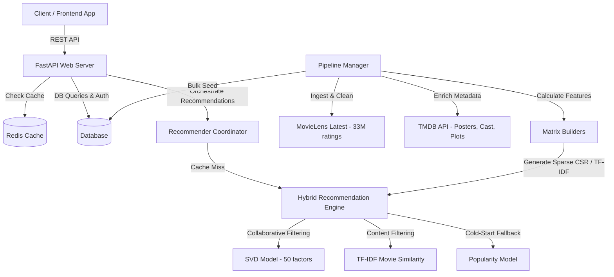

# MOVICO — Production-Grade Movie Recommendation Backend

MOVICO is a high-performance, production-quality movie recommendation service built with **FastAPI**, **SQLAlchemy**, **Redis**, and **scikit-learn / SciPy**.

It uses the **MovieLens Latest (33M+ ratings, 86K+ movies)** dataset — the largest publicly available movie ratings dataset — and enriches movies with **TMDB metadata** (posters, plots, cast, directors, trailers) to enable frontend developers to build stunning, Netflix-quality interfaces with a single API call.

---

## Key Features

- **Hybrid Recommendation Engine**: Combines Matrix Factorization (Funk SVD), Content-Based TF-IDF Similarity, and Popularity Fallback
- **TMDB Metadata Enrichment**: Automatic batch enrichment of 86K+ movies with posters, plots, cast, directors, and release dates
- **Frontend-Ready API**: Every movie response includes full `poster_url`, `backdrop_url`, `overview`, `cast_list`, `director` — zero extra work for frontend developers
- **Large-Scale Training**: Handles 33M+ ratings via intelligent sampling and configurable SVD hyperparameters
- **Cold-Start Handling**: Popularity-based recommendations for new users with zero history
- **Redis Caching**: Sub-millisecond recommendation retrieval with soft fallback when Redis is offline
- **JWT Authentication**: Secure user registration, login, and per-user recommendation histories
- **Comprehensive Evaluation**: RMSE, MAE, Precision@K, NDCG, Catalog Coverage, Diversity, Novelty metrics
- **Docker-Ready**: Multi-container orchestration with PostgreSQL + Redis, or local SQLite mode

---

## Architecture Overview



### How Recommendations Work

1. **New User (Cold Start)**: If a user has fewer than 5 ratings, the system recommends globally popular movies using: `mean_rating × log(vote_count)`

2. **Active User (Hybrid)**: For users with 5+ ratings, the engine blends two models:
   - **Collaborative Filtering (70% weight)**: Funk SVD Matrix Factorization trained via SGD learns latent user preferences from 33M+ rating patterns
   - **Content-Based (30% weight)**: TF-IDF genre vectors compute cosine similarity between the user's taste profile and all candidate movies

3. **Result**: Already-watched movies are filtered out, and the top-K highest scoring candidates are returned with full TMDB metadata

---

## What the Frontend Developer Gets

A single API call (`GET /api/recommendations/`) returns everything needed to render a movie card:

```json
{
  "recommendation_type": "hybrid",
  "movies": [
    {
      "id": 356,
      "title": "Forrest Gump (1994)",
      "genres": "Comedy|Drama|Romance|War",
      "popularity_score": 18.42,
      "poster_url": "https://image.tmdb.org/t/p/w500/arw2vcBvEbcFQ8NZRQ.jpg",
      "backdrop_url": "https://image.tmdb.org/t/p/original/3h1JZGDhZ8nz.jpg",
      "overview": "A man with a low IQ has accomplished great things in his life...",
      "director": "Robert Zemeckis",
      "cast_list": "Tom Hanks, Robin Wright, Gary Sinise, Sally Field",
      "release_date": "1994-07-06",
      "vote_average": 8.5,
      "runtime": 142
    }
  ],
  "execution_time_seconds": 0.0342
}
```

---

## Directory Structure

```text
├── app/
│   ├── api/
│   │   ├── routes/          # API endpoints (auth, movies, ratings, recommendations, system)
│   │   ├── auth_helper.py   # JWT & Password utility functions
│   │   └── middleware.py    # Request logger and exception handlers
│   ├── config/
│   │   └── settings.py      # App configurations (Pydantic settings)
│   ├── database/
│   │   ├── connection.py    # Database session setup (SQLite/PostgreSQL)
│   │   ├── models.py        # SQLAlchemy relational schemas with TMDB metadata columns
│   │   └── schemas.py       # Pydantic schemas with poster_url/backdrop_url computation
│   ├── models/
│   │   ├── base.py          # Abstract base class for recommenders
│   │   ├── collaborative.py # Funk SVD Matrix Factorization (50 latent factors)
│   │   ├── content_based.py # Genre TF-IDF Similarities
│   │   ├── popularity.py    # Vote-weighted popularity baseline
│   │   ├── hybrid.py        # Combined prediction scorer
│   │   ├── evaluator.py     # RMSE, MAE, Precision@K, NDCG, Diversity, Novelty
│   │   └── trainer.py       # Training with intelligent sampling for 33M+ datasets
│   ├── pipeline/
│   │   ├── ingest.py        # MovieLens downloader & database seeder
│   │   ├── preprocess.py    # Sparse matrix builders
│   │   └── tmdb_enricher.py # TMDB API batch enrichment pipeline
│   └── services/
│       ├── cache.py         # Redis client for caching
│       └── recommender.py   # Recommendation coordinator and history logger
│   └── main.py              # Application entrypoint & startup triggers
├── tests/                   # Automated pytest suite
├── Dockerfile               # Build configuration for container image
├── docker-compose.yml       # Multi-container manager (FastAPI + Postgres + Redis)
├── test_api.http            # VS Code REST Client test file
├── requirements.txt         # Core dependencies
└── pytest.ini               # Test configurations
```

---

## Quick Start (Local Development — No Docker Required)

1. **Install Dependencies**:
   ```bash
   pip install -r requirements.txt
   ```

2. **Configure Environment**:
   ```bash
   copy .env.example .env
   ```
   Then edit `.env` and add your TMDB API key (free from https://www.themoviedb.org/settings/api).

3. **Start the Server**:
   ```bash
   python -m uvicorn app.main:app --reload --port 8005
   ```
   On first launch, the server will:
   - Download the MovieLens Latest dataset (~335MB)
   - Seed 86K+ movies and 33M+ ratings into SQLite
   - Sample 5M ratings and train SVD with 50 factors
   - Save model checkpoints

4. **Enrich Movies with TMDB Metadata**:
   After the server is running, trigger TMDB enrichment:
   ```
   POST http://localhost:8005/api/system/enrich
   ```

5. **Open Interactive API Docs**:
   Navigate to http://localhost:8005/docs

---

## Quick Start (Docker Compose)

```bash
# Set your TMDB API key
export TMDB_API_KEY=your_key_here

# Launch all services
docker-compose up --build
```

---

## API Endpoints Reference

### Authentication (`/api/auth`)
| Method | Endpoint | Description |
|--------|----------|-------------|
| POST | `/api/auth/register` | Create a new user account |
| POST | `/api/auth/login` | Authenticate and get JWT token |
| GET | `/api/auth/me` | Get authenticated user profile |

### Movies (`/api/movies`)
| Method | Endpoint | Description |
|--------|----------|-------------|
| GET | `/api/movies/search?q={query}` | Search movies (returns TMDB metadata) |
| GET | `/api/movies/{id}` | Get single movie with full metadata |
| GET | `/api/movies/{id}/similar` | Get similar movies (content/collaborative) |

### Recommendations (`/api/recommendations`)
| Method | Endpoint | Description |
|--------|----------|-------------|
| GET | `/api/recommendations/` | Personalized hybrid recommendations with full metadata |

### Ratings (`/api/ratings`)
| Method | Endpoint | Description |
|--------|----------|-------------|
| POST | `/api/ratings/` | Submit or update a rating |
| GET | `/api/ratings/history` | Get user's rating history |
| POST | `/api/ratings/watchlist` | Add to watchlist |
| GET | `/api/ratings/watchlist` | Get watchlist |
| DELETE | `/api/ratings/watchlist/{id}` | Remove from watchlist |

### System (`/api/system`)
| Method | Endpoint | Description |
|--------|----------|-------------|
| GET | `/api/system/health` | Health check (DB, Redis, Models) |
| GET | `/api/system/stats` | Database stats & enrichment progress |
| GET | `/api/system/metrics` | Model evaluation metrics |
| POST | `/api/system/train` | Trigger model retraining |
| POST | `/api/system/enrich` | Trigger TMDB metadata enrichment |

---

## Running Tests

```bash
python -m pytest -v
```
