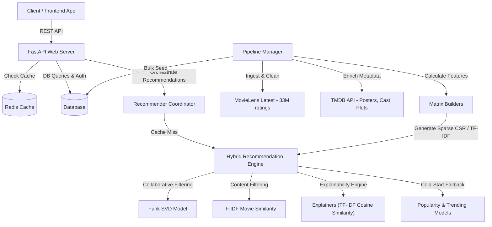

# MOVICO — Production-Grade Movie Recommendation Backend

MOVICO is a high-performance, production-quality movie recommendation service built with **FastAPI**, **SQLAlchemy**, **Redis**, and **scikit-learn / SciPy**.

It is engineered to run on the **MovieLens Latest (33M+ ratings, 86K+ movies)** dataset — the largest publicly available movie ratings dataset — and dynamically enriches movies with **TMDB metadata** (posters, plots, cast, directors, trailers) to enable frontend developers to build stunning, Netflix-quality interfaces with a single API call.

---

## 🚀 Key Features

*   **Hybrid Recommendation Engine**: Combines Funk SVD Matrix Factorization (Collaborative Filtering) with multi-signal TF-IDF representation (Content-Based) and a time-decayed Popularity baseline.
*   **Explainable Recommendations**: Offers optional "Because you watched **X**" explanations using real-time TF-IDF cosine similarity against the user's high-rated history.
*   **Time-Decayed Trending Engine**: Dynamically calculates trending scores by applying exponential decay weights to recent user ratings.
*   **8-Channel Content Features**: Combines genres (3x weight), title, overview, director (2x weight), cast, user-generated tags, release decade, and language for hyper-accurate content recommendations.
*   **TMDB Metadata Enrichment**: Automated batch enrichment of 86K+ movies with poster URLs, backdrop URLs, cast lists, directors, and runtimes.
*   **Pagination & Sorting**: Browse and search endpoints are fully paginated with sorting options (`popularity`, `trending`, `title`, `vote_average`, `release_date`).
*   **Redis Caching**: Sub-millisecond recommendation retrieval with soft fallback when Redis is offline.
*   **Docker-Ready**: Multi-container orchestration with PostgreSQL + Redis, or local SQLite mode.

---

## 📐 Architecture Overview



---

## 🧠 Algorithmic Detail

### 1. Hybrid Score Blending
For users with 5+ ratings, recommendations are scored using a linear combination:
$$\text{Score} = w_{\text{collab}} \times \text{Prediction}_{\text{SVD\_norm}} + w_{\text{content}} \times \text{Similarity}_{\text{TF-IDF}}$$
Where $w_{\text{collab}} = 0.7$, $w_{\text{content}} = 0.3$, and predicted collaborative ratings are normalized from $[0.5, 5.0]$ to $[0, 1]$.

### 2. Time-Decayed Trending Score
Unlike static popularity, the trending score downweights older reviews using exponential half-life decay:
$$\text{Weight}(t) = 2^{-\frac{T_{\text{max}} - t}{\text{Half-Life}}}$$
$$\text{Trending Score} = \text{Weighted Mean Rating} \times \log(1 + \sum \text{Weight})$$
Where $T_{\text{max}}$ is the latest rating timestamp in the database and the half-life is set to **1 year**.

### 3. Explainability Engine ("Because you watched X")
To demystify recommendations, the system scans the user's high-rated movies ($R \ge 4.0$) and computes pairwise cosine similarity against the recommended candidates:
$$\text{Similarity}(A, B) = \cos(\theta) = \frac{\mathbf{v}_A \cdot \mathbf{v}_B}{\|\mathbf{v}_A\| \|\mathbf{v}_B\|}$$
The highest-scoring similarity match above $0.05$ is returned as the explanation payload.

---

## 📦 API Reference

### Authentication (`/api/auth`)
| Method | Endpoint | Description |
|--------|----------|-------------|
| POST | `/api/auth/register` | Create a new user account |
| POST | `/api/auth/login` | Authenticate and get JWT token |
| GET | `/api/auth/me` | Get authenticated user profile |

### Movies (`/api/movies`)
| Method | Endpoint | Description |
|--------|----------|-------------|
| GET | `/api/movies/genres` | Get all available genres with movie counts |
| GET | `/api/movies/trending` | Get time-decayed trending movies (paginated) |
| GET | `/api/movies/browse` | Browse catalog with sorting, pagination, and genre/year/language filters |
| GET | `/api/movies/search?q={query}` | Search movies with optional genre filter |
| GET | `/api/movies/{id}` | Get single movie with full metadata |
| GET | `/api/movies/{id}/similar` | Get similar movies (content/collaborative) |

### Recommendations (`/api/recommendations`)
| Method | Endpoint | Description |
|--------|----------|-------------|
| GET | `/api/recommendations/` | Get personalized hybrid recommendations with explanations |

**Parameters:**
*   `limit` (default: 10) — number of recommendations
*   `bypass_cache` (default: false) — recalculate recommendation scores
*   `include_explanations` (default: true) — attach explanation objects to items

### User Ratings & Watchlist (`/api/ratings`)
| Method | Endpoint | Description |
|--------|----------|-------------|
| POST | `/api/ratings/` | Submit or update a rating |
| GET | `/api/ratings/history` | Get user's rating history (paginated) |
| POST | `/api/ratings/watchlist` | Add movie to watchlist |
| GET | `/api/ratings/watchlist` | Get watchlist (paginated) |
| DELETE | `/api/ratings/watchlist/{id}` | Remove movie from watchlist |

### System & Pipeline Administration (`/api/system`)
| Method | Endpoint | Description |
|--------|----------|-------------|
| GET | `/api/system/health` | Health check (DB, Redis, SVD/TF-IDF Model status) |
| GET | `/api/system/stats` | DB ingestion stats & TMDB enrichment progress |
| GET | `/api/system/metrics` | Recommender validation metrics (RMSE, Coverage, etc.) |
| POST | `/api/system/train` | Trigger offline training pipeline |
| POST | `/api/system/enrich` | Trigger batch TMDB metadata enricher |

---

## 📤 Sample Recommendation Payload

`GET /api/recommendations/?limit=1&include_explanations=true`

```json
{
  "recommendation_type": "hybrid",
  "movies": [
    {
      "id": 260,
      "title": "Star Wars: Episode IV - A New Hope (1977)",
      "genres": "Action|Adventure|Sci-Fi",
      "popularity_score": 18.91,
      "trending_score": 16.42,
      "poster_url": "https://image.tmdb.org/t/p/w500/6FfCtAuVAW6XJjWY705F52R8OkR.jpg",
      "backdrop_url": "https://image.tmdb.org/t/p/original/zqkmwi2qlyt5aLz8J5n1468.jpg",
      "overview": "Princess Leia is held hostage by the evil Imperial forces...",
      "director": "George Lucas",
      "cast_list": "Mark Hamill, Harrison Ford, Carrie Fisher, Alec Guinness",
      "release_date": "1977-05-25",
      "vote_average": 8.2,
      "runtime": 121,
      "original_language": "en",
      "tagline": "A long time ago in a galaxy far, far away...",
      "user_tags": "sci-fi space classic adventure epic",
      "explanation": {
        "because_watched_id": 1196,
        "because_watched_title": "Star Wars: Episode V - The Empire Strikes Back (1980)",
        "similarity_score": 0.892,
        "reason_type": "content"
      }
    }
  ],
  "generated_at": "2026-07-09T11:00:00Z",
  "execution_time_seconds": 0.0482
}
```

---

## 🛠️ Quick Start (Local Setup)

1.  **Install Dependencies**:
    ```bash
    pip install -r requirements.txt
    ```
2.  **Configure Environment**:
    ```bash
    copy .env.example .env
    ```
    Edit `.env` to include your `TMDB_API_KEY`.
3.  **Run Server**:
    ```bash
    python -m uvicorn app.main:app --reload --port 8005
    ```
4.  **Run Tests**:
    ```bash
    python -m pytest -v
    ```
