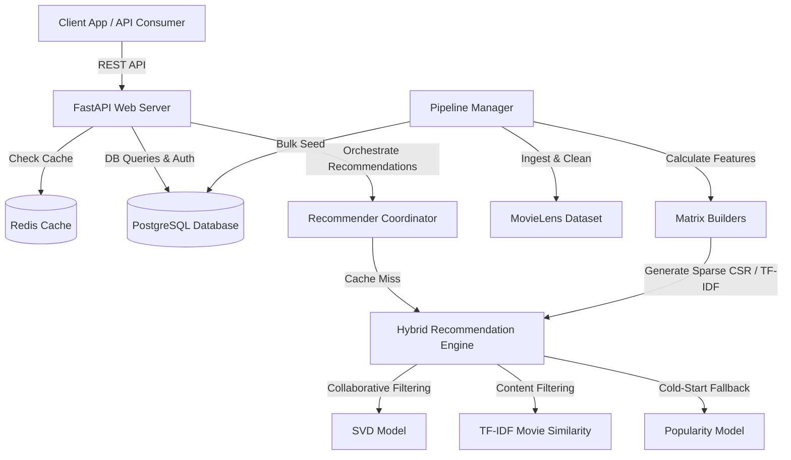

# MOVICO - Production-Grade Movie Recommendation Backend

MOVICO is a high-performance, production-quality movie recommendation service built with **FastAPI**, **PostgreSQL**, **Redis**, and **scikit-learn** / **SciPy**. 

It refactors a basic collaborative filtering Jupyter notebook into a robust modular architecture featuring automated data ingestion, advanced matrix factorization algorithms, content similarities, hybrid recommendation engines, real-time caching, audit logging, and Docker containerization.

---

## Architecture Overview



### Recommendation Models
1. **Popularity-Based (Baseline)**: For cold-start users (fewer than 5 ratings), recommendations are generated using a scaled score: `mean_rating * log1p(vote_count)`.
2. **Collaborative Filtering (Funk SVD)**: Matrix Factorization trained via Stochastic Gradient Descent (SGD) on user-item sparse rating matrices. Predicts user ratings on the standard scale $[0.5, 5.0]$.
3. **Content-Based (TF-IDF)**: Extracts genre text metadata, constructs term frequency-inverse document frequency vectors, and computes Cosine Similarity profiles for users.
4. **Hybrid Engine**: Blends normalized SVD rating predictions and TF-IDF similarity scores using a weighted combination:
   $$\text{Score}_{\text{hybrid}} = w_{\text{collab}} \times \text{Norm}(\text{SVD}) + w_{\text{content}} \times \text{Similarity}_{\text{tfidf}}$$

---

## Directory Structure

```text
├── app/
│   ├── api/
│   │   ├── routes/          # API endpoints (auth, movies, ratings, recommendations, system)
│   │   ├── auth_helper.py   # JWT & Password utility functions
│   │   └── middleware.py    # Request logger and exception handlers
│   ├── config/
│   │   └── settings.py      # App configurations (Pydantic settings)
│   ├── database/
│   │   ├── connection.py    # Database session setup
│   │   ├── models.py        # SQLAlchemy relational schemas
│   │   └── schemas.py       # Pydantic schemas for request/response serialization
│   ├── models/
│   │   ├── base.py          # Abstract base class for recommenders
│   │   ├── collaborative.py # Funk SVD Matrix Factorization
│   │   ├── content_based.py # Genre TF-IDF Similarities
│   │   ├── popularity.py    # Vote-weighted popularity baseline
│   │   ├── hybrid.py        # Combined prediction scorer
│   │   ├── evaluator.py     # Metrics (RMSE, MAE, Precision@K, NDCG, Diversity, Novelty)
│   │   └── trainer.py       # Validation splitter & training coordinator
│   ├── pipeline/
│   │   ├── ingest.py        # Dataset downloader & database seeder
│   │   └── preprocess.py    # Sparse matrix builders
│   └── services/
│       ├── cache.py         # Redis client for caching
│       └── recommender.py   # Recommendation coordinator and history logger
│   └── main.py              # Application entrypoint & startup triggers
├── tests/                   # Automated pytest suite
├── Dockerfile               # Build configuration for container image
├── docker-compose.yml       # DevSecOps multi-container manager
├── requirements.txt         # Core dependencies
└── pytest.ini               # Test configurations
```

---

## Quick Start (Docker Compose)

The easiest way to spin up the entire production stack (FastAPI web server, PostgreSQL database, and Redis cache) is using Docker Compose.

1. **Clone and Navigate**:
   ```bash
   cd Movie-Recommendation-System-MOVICO-main
   ```
2. **Environment Variables**:
   Copy the example environment file:
   ```bash
   copy .env.example .env
   ```
3. **Launch Containers**:
   ```bash
   docker-compose up --build
   ```
4. **Auto-Seeding & Training**:
   Upon first launch, the `web` container detects an empty database. It will:
   - Automatically download the latest **MovieLens 100K** dataset.
   - Parse, clean, and map titles.
   - Bulk-seed PostgreSQL with `Movie` and `Rating` tables.
   - Preprocess TF-IDF features and train the Funk SVD model.
   - Save trained model checkpoints to `/workspace/models_checkpoint`.

Once running, the interactive Swagger documentation is available at `http://localhost:8000/docs`.

---

## Local Development Setup

If you prefer to run the components locally outside of Docker:

1. **Create Virtual Environment**:
   ```bash
   python -m venv venv
   source venv/Scripts/activate  # On Windows: venv\Scripts\activate
   ```
2. **Install Dependencies**:
   ```bash
   pip install -r requirements.txt
   ```
3. **Configure Environment Variables**:
   Update your `.env` file with your local PostgreSQL and Redis connection details:
   ```env
   POSTGRES_HOST=localhost
   POSTGRES_PORT=5432
   POSTGRES_USER=movico_user
   POSTGRES_PASSWORD=movico_pass
   POSTGRES_DB=movico_db
   REDIS_HOST=localhost
   REDIS_PORT=6379
   ```
4. **Run Application**:
   ```bash
   uvicorn app.main:app --reload
   ```

---

## API Endpoints Reference

### Authentication (`/api/auth`)
* `POST /api/auth/register` - Create a new user account.
* `POST /api/auth/login` - Authenticate credentials and return JWT access token.
* `GET /api/auth/me` - Retrieve authenticated user profile info.

### Movies (`/api/movies`)
* `GET /api/movies/search?q={query}` - Search the database catalog.
* `GET /api/movies/{movie_id}` - Retrieve metadata for a single movie.
* `GET /api/movies/{movie_id}/similar?method={content|collaborative}` - Retrieve similar movies based on content or collaborative latent vectors.

### Recommendations (`/api/recommendations`)
* `GET /api/recommendations/?limit={n}&bypass_cache={true|false}` - Fetch personalized recommendations for the authenticated user using the Hybrid model. Cache-enabled via Redis.

### Ratings & User Activity (`/api/ratings`)
* `POST /api/ratings/` - Submit or update a movie rating. (Clears user's recommendation cache).
* `GET /api/ratings/history` - Retrieve rating history for the logged-in user.
* `POST /api/ratings/watchlist?movie_id={id}` - Add movie to watchlist.
* `GET /api/ratings/watchlist` - Retrieve user's watchlist.
* `DELETE /api/ratings/watchlist/{movie_id}` - Remove movie from watchlist.

### System Administration (`/api/system`)
* `GET /api/system/health` - Check health status of Postgres, Redis, and Models.
* `GET /api/system/metrics` - Fetch SVD & Hybrid evaluation metrics (RMSE, MAE, Precision@10, NDCG@10, Coverage, Diversity, Novelty).
* `POST /api/system/train` - Trigger background retraining of SVD and TF-IDF models.

---

## Running Tests

An automated test suite is provided in `/tests` to verify code correctness. It uses an in-memory SQLite database, isolating the test runs from your development databases.

Execute the test runner:
```bash
python -m pytest -v
```
